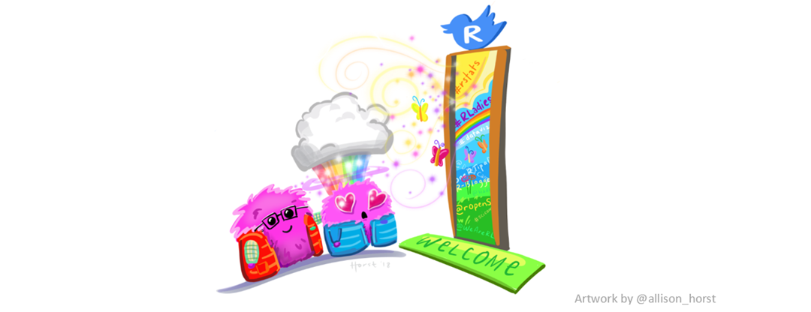
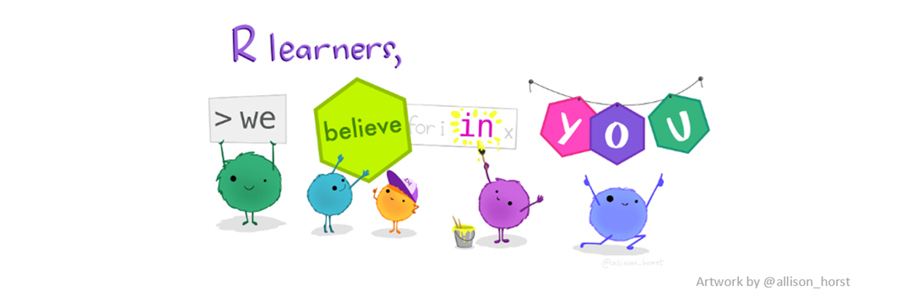

<!-- note to self - when making update, have to click run document and click the blue publish button... -->

```{r setup, include=FALSE}
library(learnr)
knitr::opts_chunk$set(echo = FALSE)
```

## Welcome! 


Hi everyone `r emo::ji("wave")` and welcome to the Basic Syntax Interactive Lesson!

<center>

{style="width: 700px; "}
</center>

### How does this lesson work?

This website is designed for you to go through one of the [R4Beginners](https://r4beginners.com/) lessons on your own, without the hassle of installing or downloading R or RStudio. 

I built this lesson using the `learnr` package. Throughout the lesson, you will see chunks of code that you can run by pressing the "Run Code" button. Feel free to edit the code and practice writing your own code. This website is designed for you to play around and get familiar with R code. 

I've modified this interactive lesson from the Basic Syntax Lesson on the [R4Beginners](https://r4beginners.com/) website. You can also download the Basic Syntax lesson from [GitHub](https://github.com/jennysloane/r4beginners-lessons) if you wish to complete the full lesson within RStudio. 

**License and Citation:** You can use, share, modify, and adapt any of the tutorials or lessons, but please include the following attribution: *R4Beginners. (May 30, 2022). Zenodo. [https://doi.org/10.5281/zenodo.6595406](https://doi.org/10.5281/zenodo.6595406)*

## Overview

In this lesson we will review some of the basic syntax of R, including the following common operators:

- `<-` assignment operator 
- `>` greater than operator 
- `<` less than operator 
- `==` equality operator  
- `!=` inequality operator 
- `&` and operator 
- `|` or operator 

## Syntax 

Syntax in computer programming is a set of rules that defines the structure of a language, similar to how we have rules for grammar and spelling. If you write a sentence with incorrect spelling or grammar, the sentence may not make sense. If you write code without proper syntax, the code won't be able to run and you'll get an error message. 

### Example

In this example, we will print the following famous coding statement: `hello world`. Try it out yourself by pressing "Run Code".

```{r hello-world, exercise=TRUE}
print("hello world")
```

I encourage you to edit the code above. 

- See what happens if you write `prin("hello world")`. Notice I spelled "print" wrong - I did this on purpose because we often accidentally spell words wrong when coding! 
- Can you figure out how to change the code to print your name??

## Assignment Operator

- In R, one of the most common operators is the "assignment operator" which looks like this arrow `<-`.
- In most situations, it would also be acceptable to use the = sign, but in R, the arrow is the typical notation.
- In this next example, we are assigning x to be 10, y to be 25, and z to be 100.
- x, y, and z are stored as values (or variables) in our Environment (which you will be able to see if you try this lesson in RStudio).

```{r assign-vars, exercise=TRUE}
x <- 10
x

y <- 25
y

z <- 100
z
```

- When you use the assignment operator, it saves the values (x, y, z) in your environment. This means that R will remember these values.

## Greater and Less than Operators

- In this example, we will ask if x is **greater** than y? 
- Remember, we have x assigned to 10 and y assigned to 25. So, is 10 greater than 25? True or False? 

```{r greater-than, exercise=TRUE}
x <- 10
y <- 25
z <- 100

x > y
```

- Is x **less** than y? 

```{r less-than, exercise=TRUE}
x <- 10
y <- 25
z <- 100

x < y 
```


## Equality Operators

### `==` is the equal-to operator

- We can think of the example below as "is x equal to y?" 
- Notice, in this scenario R will return TRUE or FALSE and the values of x and y do not change.

*Be careful not to confuse == and =* 

```{r equality, exercise=TRUE}
x <- 10
y <- 25
z <- 100

x == y 
x # x is still 10
```

*Note the first line that is printed is for line 5: x == y and the second line that is printed is for line 6: x*

- See what happens if we instead use `=` instead of `==`. 

```{r equals, exercise=TRUE}
x <- 10
y <- 25
z <- 100

x = y
x # x is now 25
```

### `!=` is the not-equal-to operator 

- We can think of the example below as: "Is x *not equal* to y, True or False?"

```{r not-equal-to, exercise=TRUE}
x <- 10
y <- 25
z <- 100

x != y 
```

## The AND and OR Operators

### The `&` Operator

- We can think of the example below in two parts: Is z greater than 50 **AND** is z less than 200? 
- Remember, z is 100. So, is it true that 100 > 50 **AND** 100 < 200? 
- In order for this statement to be true, both pieces must be true.

```{r and-operator, exercise=TRUE}
x <- 10
y <- 25
z <- 100

z > 50 & z < 200 
```

- What about if we asked the following: is z > 50 **AND** is z > 200? 

```{r and-operator-two, exercise=TRUE}
x <- 10
y <- 25
z <- 100

z > 50 & z > 200
```

### The `|` Operator 

- We can again think of the below example in two parts: is z greater than 50 **OR** is z greater than 200?
- However, this time, in order for the statement (aka expression) to be true, only one of the parts needs to be true.
- So, let's test the same line of code we had in the last example but with an `|` operator instead of an `&` operator. 

```{r or-operator, exercise=TRUE}
x <- 10
y <- 25
z <- 100

z > 50 | z > 200
```

## Exercises

Now, let's test out your new knowledge and R skills with some practice problems. 

In this exercise, we'll compare the heights (in inches) of some amazing female artists: Jennifer Lopez, Taylor Swift, and Miley Cyrus.

1. Create three variables with each woman's respective height (Jennifer = 64.57, Taylor = 70.87, Miley = 64.96). Save your three variables as `jennifer`, `taylor`, and `miley`. Save one variable per line.


```{r exercise1, exercise=TRUE}

```

<!-- <div id="exercise1-hint"> -->
<!-- **Hint:** Remember to use the assignment operator. -->
<!-- </div> -->

```{r exercise1-solution}
jennifer <- 64.57
taylor <- 70.87
miley <- 64.96
```

2. Is Miley shorter than Taylor? Write 1 line of code that will return the answer as either `TRUE` of `FALSE`.

```{r exercise2, exercise=TRUE}

```

<!-- <div id="exercise2-hint"> -->
<!-- **Hint:** You may want to try the `<` operator. -->
<!-- </div> -->


```{r exercise2-solution}
miley < taylor
```


3. Are Miley and Jennifer the same heights? 

```{r exercise3, exercise=TRUE}

```

<!-- <div id="exercise3-hint"> -->
<!-- **Hint:** You may want to try the `==` operator. -->
<!-- </div> -->

```{r exercise3-solution}
miley == jennifer
```

4. Is Miley taller than both Jennifer **and** Taylor? 

```{r exercise4, exercise=TRUE}

```

<!-- <div id="exercise4-hint"> -->
<!-- **Hint:** You may want to try the `&` operator. -->
<!-- </div> -->

```{r exercise4-solution}
miley > jennifer & miley > taylor
```


5. Is Miley taller than either Jennifer **or** Taylor? 

```{r exercise5, exercise=TRUE}

```

<!-- <div id="exercise5-hint"> -->
<!-- **Hint:** You may want to try the `|` operator. -->
<!-- </div> -->

```{r exercise5-solution}
miley > jennifer | miley > taylor
```


## End of Lesson `r emo::ji("tada")` 

Excellent job completing this lesson! 

If you're interested in continuing your R journey, feel free to check out the [Getting Started](https://r4beginners.com/getting_started.html) page on the R4beginners website for free resources and tutorials to help you get started. 

Remember, learning how to code will take time and patience. But, it is also a lot of fun and super rewarding! So enjoy the journey!!

<center>
{style="width: 700px; "}
</center>

